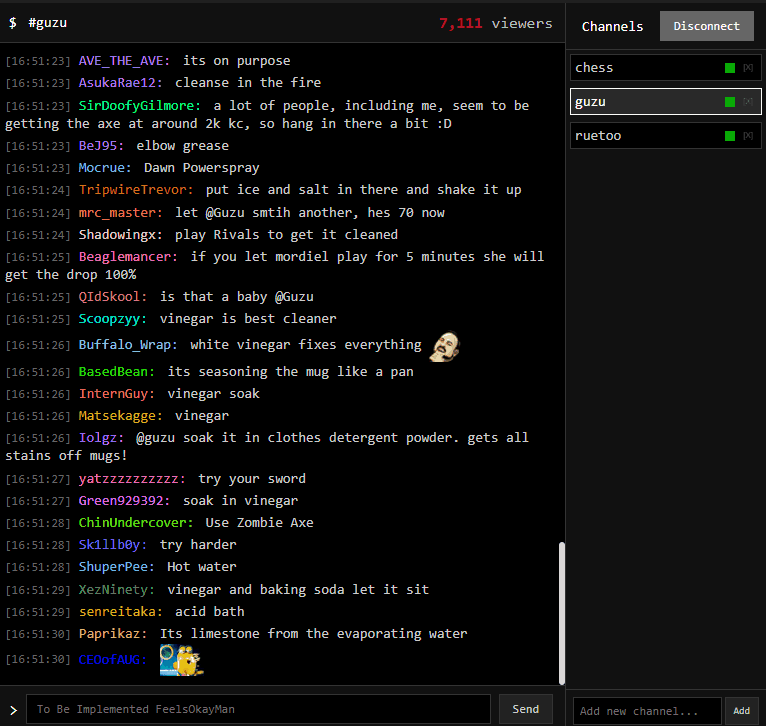

# Watcherino

Watcherino is a chat client for twitch focused on privacy, minimalism and notifications.

### Chat Management

-   **Multi-channel monitoring** - Connect to and monitor multiple Twitch channels simultaneously
-   **Channel switching** - Easily switch between active channels with a clean sidebar interface
-   **Message buffering** - Configurable message history with ring buffer for performance
-   **Real-time chat** - Live chat messages with proper timestamp display

### Privacy & Minimalism

-   **No telemetry** - Zero data collection or tracking
-   **Lightweight interface** - Terminal-inspired UI focused on functionality over aesthetics
-   **Local configuration** - All settings stored locally in simple text files

### Emote Support

-   **Third-party emotes** - Full support for BTTV, FFZ, and 7TV emotes
-   **Inline display** - Emotes render directly in chat messages
-   **Hover tooltips** - View emote names on hover

### Text-to-Speech & Notifications

-   **TTS notifications** - Configurable text-to-speech for highlighted messages
-   **Per-channel TTS settings** - Enable/disable TTS individually for each channel
-   **Audio alerts** - Sound notifications for keyword matches
-   **Keyword highlighting** - Configure custom keywords to trigger notifications
-   **Visual indicators** - Red borders around highlighted messages and channels
-   **Channel notifications** - Visual indicators when monitored channels receive highlights
